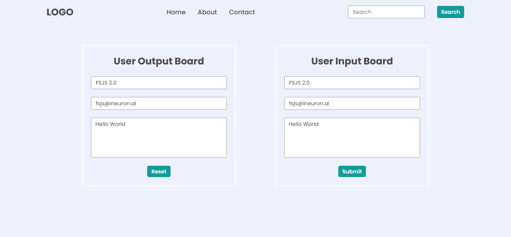

# Dom Assigment 28-Jan - Q- 1, 2, 3

## Question - 1 - Here
Output Q-1 - Task-1


Code --
```
let li_hireMe = document.querySelector("Header>nav>ul");

li_hireMe.lastElementChild.innerText = "Projects";
li_hireMe.innerHTML += `<li><a href="./contact/contact.html">Hire Me</a></li>`;
```

Output Q-1 - Task-2


Code --
```
document.querySelector(".search-field").firstElementChild.placeholder = "Search My Project";
```

Output Q-1 - Task-3


<!-- All things are same on task3 -->


Output Q-1 - Task-4


Code --
```
let hiteshImage = document.querySelector(".hero-right-section").firstElementChild;
hiteshImage.src = "./hiteshsirimage.jpg";
```

Output Q-1 - Task-5


Code --
```
let chatWithMe = document.querySelector(".hero-right-section-btns");
let supportMe = chatWithMe.lastElementChild.cloneNode(true);
supportMe.innerText = "Support Me";
chatWithMe.appendChild(supportMe);
```

Output Q-2 - Task-1


Code --
```

```


Output Q-2 - Task-2


Code --
```
let parent = document.querySelector(".accordian-wrapper");
let h3 = document.createElement("h3");
h3.innerText = "Skill";
let p = document.createElement("p");
p.innerText = "I posses very good command over the Full Stack Development Technologies like MERN which can be seen in my work over the github.";
let div = document.createElement("div");
div.appendChild(h3);
div.appendChild(p);
div.classList.add("accordian")
parent.appendChild(div);
```

Output Q-3 - Task-1


Code --
```
document.querySelector(".enterName").value = "FSJS 2.0";
document.querySelector(".userName").value = "FSJS 2.0";

document.querySelector(".enterMail").value = "fsjs@ineuron.ai";
document.querySelector(".userEmail").value = "fsjs@ineuron.ai";

document.querySelector(".enterMessage").value = "Hello World";
document.querySelector(".userMessage").value = "Hello World";
```