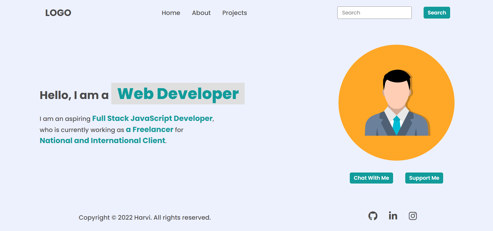

# Dom Assigment 28-Jan - Q- 1, 2, 3

## Task - 1 - Here
Output Task-1 - 1st


Code --
```
let li_hireMe = document.querySelector("Header>nav>ul");
li_hireMe.lastElementChild.innerText = "Projects";

li_hireMe.innerHTML += `<li><a href="./contact/contact.html">Hire Me</a></li>`;
document.querySelector("footer").lastElementChild.innerHTML = "";
```


Output Task-1 - 2nd


Code --
```
document.querySelector(".search-field").firstElementChild.placeholder = "Search My Project";
```


Output Task-1 - 3rd


code --
```
let employee = document.querySelector(".hero-left-section").lastElementChild.firstElementChild.nextElementSibling.nextElementSibling;
employee.innerText = "an employee"
let ineuron = document.querySelector(".hero-left-section").lastElementChild.lastElementChild;
ineuron.innerText = "iNeuron Itelligence Pvt Ltd";
```


Output Task-1 - 4th


Code --
```
let hiteshImage = document.querySelector(".hero-right-section").firstElementChild;
hiteshImage.src = "./hiteshsirimage.jpg";
```


Output Task-1 - 5th


Code --
```
let chatWithMe = document.querySelector(".hero-right-section-btns");
let supportMe = chatWithMe.lastElementChild.cloneNode(true);
supportMe.innerText = "Support Me";
chatWithMe.appendChild(supportMe);
```


## Task - 2 - Here
Output Task-2 - 1st


Code --
```

```

Output Task-2 - 2nd


Code --
```
let parent = document.querySelector(".accordian-wrapper");
let h3 = document.createElement("h3");
h3.innerText = "Skill";
let p = document.createElement("p");
p.innerText = "I posses very good command over the Full Stack Development Technologies like MERN which can be seen in my work over the github.";
let div = document.createElement("div");
div.appendChild(h3);
div.appendChild(p);
div.classList.add("accordian")
parent.appendChild(div);
```


## Task - 3 - Here
Output Task-3


Code --
```
document.querySelector(".enterName").value = "FSJS 2.0";
document.querySelector(".userName").value = "FSJS 2.0";

document.querySelector(".enterMail").value = "fsjs@ineuron.ai";
document.querySelector(".userEmail").value = "fsjs@ineuron.ai";

document.querySelector(".enterMessage").value = "Hello World";
document.querySelector(".userMessage").value = "Hello World";
```


## Task - 4 - Here
Output Task-4 


code --
```
// The Archer Name Change
document.querySelector(".clash-card__level--archer").nextElementSibling.innerHTML = "The Archer";

// The Goblin Name Change
document.querySelector(".clash-card__level--goblin").nextElementSibling.innerHTML = "The Goblin";

// Details Text color -- #fff
document.querySelectorAll(".clash-card__unit-stats").forEach((all) => {all.style.color = "#fff"});
document.querySelectorAll(".no-border").forEach((all) => {all.style.color = "#fff"});

// Details Background Color Given here
document.querySelector(".clash-card__unit-stats--barbarian").style.backgroundColor = "#eb9a3d";
document.querySelector(".clash-card__unit-stats--archer").style.backgroundColor = "#ed5486";
document.querySelector(".clash-card__unit-stats--giant").style.backgroundColor = "#f58f1f";
document.querySelector(".clash-card__unit-stats--goblin").style.backgroundColor = "#80ba35";
document.querySelector(".clash-card__unit-stats--wizard").style.backgroundColor = "#50acfd";
```


## Task - 5 - Here
Output Task-5


code --
```
// Pro Subscription - btn added here -- through createElement
const sub = document.createElement("a");
sub.classList.add("btn");
sub.innerText = "Pro Subscription";
sub.href = "index.html";
document.querySelector(".btn").parentElement.appendChild(sub);

// Card Added here -- through cloneNode method
let newCard = document.querySelector(".card").cloneNode(true);
document.querySelector(".recipe-gallery").appendChild(newCard);
```


## Task - 6 - Here
Output Task-6 - 1st


code -- 
```
document.querySelector(".logo").src = "./assets/ineuron-logo.png";
```

Output Task-6 - 2nd


code -- 
```
document.querySelector(".app_price").firstElementChild.innerText = "$10";
```


## Task - 7 - Here
Output Task-7 - 1st


code --
```
let allElements = document.querySelectorAll(".main__languages>a");
for(let element of allElements){
    if(element.innerText.includes("2.0")){element.style.display = "none";}
}
```


Output Task-7 - 2nd


code --
```
document.querySelector(".main__form-btn").disabled = false;
document.querySelector(".main__form-input").disabled = false;
```


## Task - 8 - Here
Output Task-8 - 1st


code --
```
let hr = document.querySelector(".hr-line");
let h2 = document.querySelector(".new-head");
h2.innerText = "This is custom heading";
let p = document.querySelector(".new-p");
p.innerText = "This is custom Paragraph under custom heading, this is DOM project";

let list = document.querySelector("aside");
list.style.overflow = "scroll";
list.appendChild(hr);
list.appendChild(h2);
list.appendChild(p);
```

Output Task-8 - 2nd


code --
```
document.body.style.background = "none";
```


utput Task-8 - 3rd


code --
```
let navbarToggler = document.querySelector(".navbar-toggler");
navbarToggler.addEventListener("click", function(){
document.querySelector("#navbarTogglerDemo01").classList.toggle("collapse");
})
```


## Task - 9 - Here
Output Task-9 - 1st


code --
```
document.querySelector("h1").style.color = "#dc143c";
```

Output Task-9 - 1st


code --
```
let cart = document.querySelector(".add-to-cart");
cart.addEventListener("mouseover",() => {  
cart.style.backgroundColor = "#da123a";
})
cart.addEventListener("mouseout",() => {  
cart.style.backgroundColor = "hsl(158, 36%, 37%)";
})
```